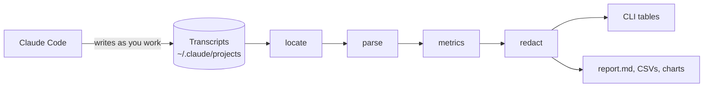
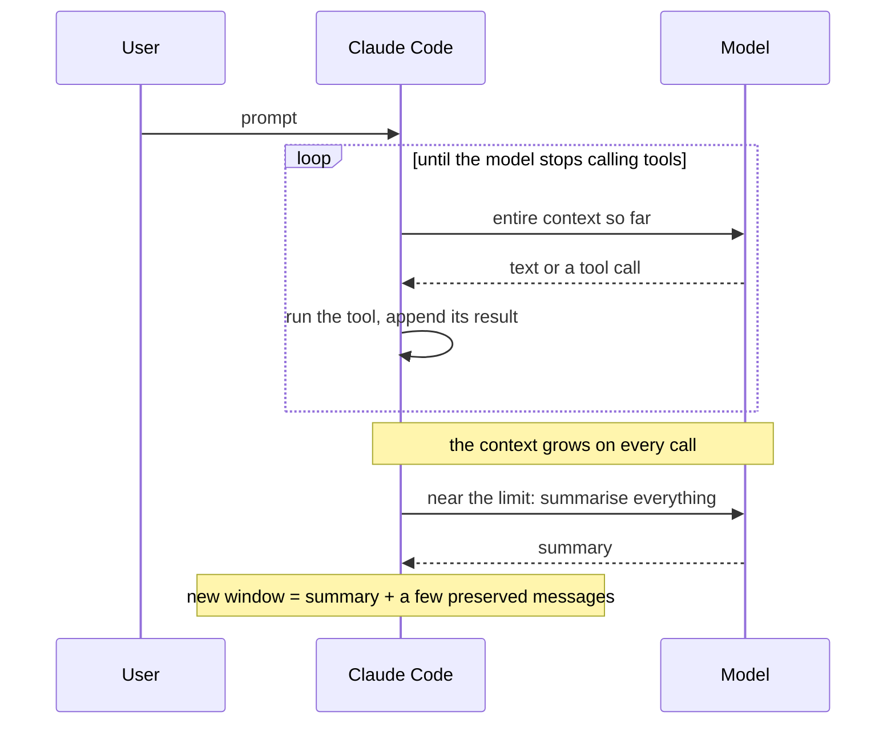
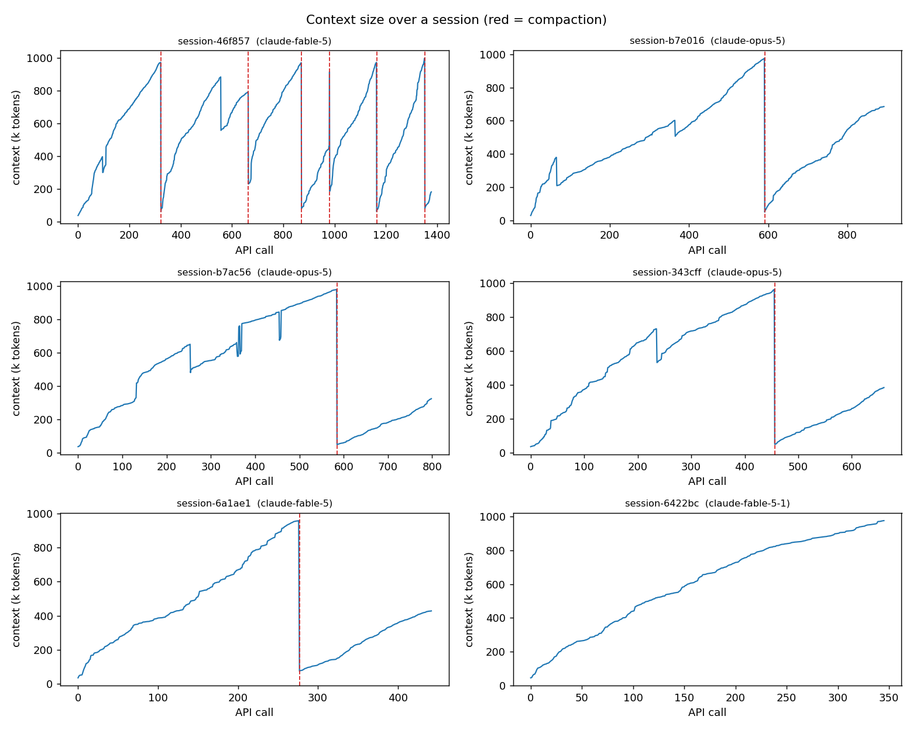

# Context Engineering

Long Claude Code sessions fill their context window. When the window is full, Claude Code
compacts: it summarises the conversation and continues in a fresh window that holds a small
fraction of what was there. Work quality drops noticeably after that point.

This repository is the headquarters for understanding and then fixing that. It contains
`ctxeng`, a small toolkit that reads Claude Code's own session transcripts in place and measures
how context is consumed, what fills it, and what each compaction costs. Later phases will add
interventions and measure them with the same instruments.

Nothing here depends on one machine. Point it at any Claude Code installation and it works.

## Status

Phase 1, diagnosis. The toolkit, its metrics, and a first set of findings are in place.
Interventions (hooks, hand-off documents, prompt changes) are deliberately deferred until the
measurements say what to change. See the [roadmap](docs/roadmap.md).

## How it works

Claude Code writes one JSON Lines transcript per session. Every model call in it carries exact
token usage, and every compaction leaves a metadata record. `ctxeng` reads those files where they
already are and derives metrics from them.



A session, as the toolkit sees it:



## Quick start

Requires Python 3.10 or newer. The core has no dependencies; charts need matplotlib.

```bash
pip install -e .              # or: pip install -e ".[charts]"

ctxeng scan                   # every session: model, effort, prompts, peak context, compactions
ctxeng growth --by model      # how much the context grows per prompt, by model
ctxeng growth --by effort     # the same, by effort level
ctxeng compactions            # every compaction: tokens before and after, retained share
ctxeng session <id-prefix>    # one session in detail
ctxeng prompts <id-prefix>    # per-prompt cost inside one session
ctxeng composition <id-prefix># what filled that session's context
ctxeng baseline --by version  # context already present on the first call
ctxeng report --charts        # writes out/report.md, CSVs, and PNG charts
```

`python -m ctxeng ...` works without installing. Transcripts are found via `CLAUDE_CONFIG_DIR`
or `~/.claude`; pass `--projects PATH` to point elsewhere. Project and session identifiers in
the output are pseudonyms, so tables can be shared as they are; add `--raw` to see the real ones.

Definitions of every metric are in [docs/metrics.md](docs/metrics.md), and notes on the
transcript format in [docs/transcript-format.md](docs/transcript-format.md).

## What the first pass found

Full write-up with tables: [docs/findings/2026-09-11-first-look.md](docs/findings/2026-09-11-first-look.md).

- **The newest model fills the window in a third of the prompts.** Sessions on Fable 5.1 filled
  the one-million-token window in 29 to 68 user prompts. Sessions on Fable 5 and Opus 5 took 55
  to 142.
- **Sessions run all the way to the limit and then lose almost everything.** Every observed
  compaction fired between 0.8M and 1.0M tokens and kept 1% to 14% of it. Manual compactions kept
  the least. Each one took two and a half to five minutes.
- **The first turn after a compaction costs about 2.3 times a normal turn.** The model spends it
  re-reading and re-discovering what the summary left out.
- **Newer model, more context per prompt.** Per-prompt growth for the newest model is about 40%
  higher at the median and three times higher at the 90th percentile than its predecessor, with
  roughly twice the tool calls per prompt. The sample is small and confounded, so this is a lead,
  not a verdict.
- **Effort level matters.** Maximum effort adds about 40% more context per prompt than the next
  level down.
- **The model's own tool calls are the biggest single source of context.** Tool inputs (file
  writes, edits, commands) plus tool results account for half to nine tenths of what enters the
  window. The fixed overhead at session start is 22k to 40k tokens and is not the problem.
- **Token counts are not comparable across models.** All but one of the large context drops
  that were not compactions coincided with a mid-session model switch, with the same context
  measuring 20% to 45% smaller afterwards.




