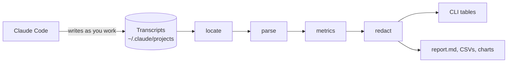
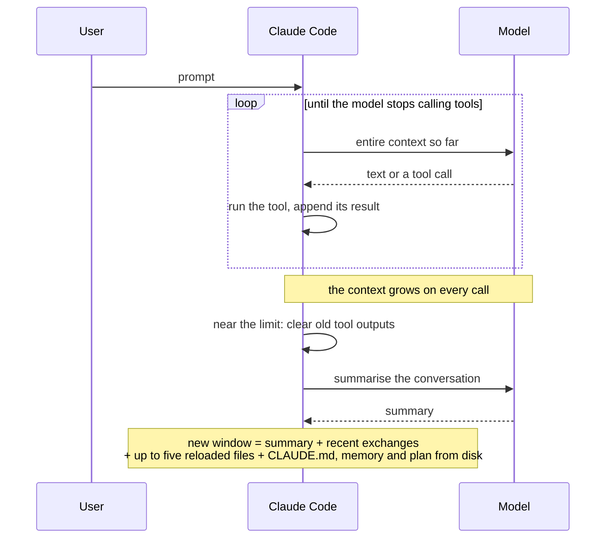

# Context Engineering

Long Claude Code sessions fill their context window. Near the limit, Claude Code compacts: it
clears older tool outputs, summarises the conversation, and continues in a window that holds the
summary, the last few exchanges, and a handful of files reloaded from disk. The session that
continues from there is noticeably worse at the task it was in the middle of. It re-reads what
it had read, repeats work, loses decisions, and drifts from where its predecessor was heading.

This repository is the headquarters for understanding and then fixing that. It contains
`ctxeng`, a small toolkit that reads Claude Code's own session transcripts in place and measures
what compaction discards, what the session after it has to do to recover, and what filled the
window in the first place. Later phases will add interventions and measure them with the same
instruments.

It is not a benchmark of Claude models. The measurements come from one person's sessions and are
about the mechanism, not about which model is better.

Nothing here depends on one machine. Point it at any Claude Code installation and it works.

## Status

Phase 1, diagnosis. The toolkit, its metrics, and a first set of findings are in place.
Interventions are deliberately deferred until the measurements say what to change. See the
[roadmap](docs/roadmap.md) and the [problem statement](docs/problem-statement.md).

## How it works

Claude Code writes one JSON Lines transcript per session. Every model call in it carries exact
token usage, and every compaction leaves a metadata record. `ctxeng` reads those files where they
already are and derives metrics from them.



A session, as the toolkit sees it:



The behaviour in that diagram is taken from Anthropic's documentation; the pages and the exact
statements used are listed in [docs/references.md](docs/references.md).

## Quick start

Requires Python 3.10 or newer. The core has no dependencies; charts need matplotlib.

```bash
git clone <this repository>
cd context-engineering
pip install -e .              # or: pip install -e ".[charts]" to be able to draw charts
ctxeng --help                 # confirms the install

ctxeng scan                   # every session: model, effort, prompts, peak context, compactions
ctxeng compactions            # every compaction: tokens before and after, retained share
ctxeng session <id-prefix>    # one session in detail
ctxeng prompts <id-prefix>    # per-prompt cost inside one session
ctxeng composition <id-prefix>  # what filled that session's context
ctxeng growth --by kind       # cost of turns that start from a compaction summary vs a prompt
ctxeng growth --by model      # context added per prompt, by model (or --by effort)
ctxeng baseline --by model    # context already present on the first call
ctxeng report --charts        # writes out/report.md, CSVs, and PNG charts
ctxeng report --publish       # aggregates only, safe to share; writes to out/publish/
ctxeng audit                  # what loads into every session, what it costs, what is used
```

The install step is what makes the `ctxeng` command available; it registers the package with
your Python, and later edits to the source take effect without reinstalling. Transcripts are
found via `CLAUDE_CONFIG_DIR` or `~/.claude`; pass `--projects PATH` to point elsewhere. Project
and session identifiers in the output are pseudonyms, so tables can be shared as they are; add
`--raw` to see the real ones.

Two things to know. Claude Code deletes transcripts untouched for 30 days by default
(`cleanupPeriodDays` in its settings), so raise that if you want history. And the transcript
format is documented as internal and liable to change between releases; the parser is written
defensively and counts what it does not understand, but it may need updating after an upgrade.

Definitions of every metric are in [docs/metrics.md](docs/metrics.md), and notes on the
transcript format in [docs/transcript-format.md](docs/transcript-format.md).

## Housekeeping

Skills, plugins, connectors and custom agents are listed to the model at every session start
and again after every compaction. `ctxeng audit` inventories all of them, attaches the cost of
each from the listings the transcripts record, attaches usage from tool calls and from Claude
Code's own counters, and writes a local report with a plan of reversible changes: hide a skill
from the listing, disable a plugin, deny a connector, archive an agent. `ctxeng audit --apply`
carries the plan out with a backup; `--undo` reverses it. A helper schedules the audit weekly.
Details and the rules are in [docs/housekeeping.md](docs/housekeeping.md).

## What the first pass found

Full write-up with tables: [docs/findings/2026-09-11-first-look.md](docs/findings/2026-09-11-first-look.md).

- **Sessions run all the way to the limit and then keep almost nothing.** Every observed
  compaction fired between 0.8M and 1.02M tokens and retained 1% to 14% of the window. Manual
  compactions retained the least. Each one took between two and a half and five and a half
  minutes.
- **The summary is small.** Four to eight thousand tokens. The rest of the new window is the
  last few messages and what Claude Code reloads from disk.
- **The first turn after a compaction costs about 2.3 times a normal turn**, with twice the tool
  calls and three times the tool-result text: the model reading back what the summary left out.
  Whether its later work then diverges is the next thing to measure.
- **Most of what gets discarded was transient anyway.** Tool inputs and tool results are half to
  nine tenths of what enters the window. The person's own words are about 2% and the assistant's
  prose about 12%. The loss that matters is whatever part of that small residue the summary
  missed, not the 86% to 99% of tokens thrown away.
- **The fixed overhead is small and comes back for free.** The scaffolding restored from disk
  after compaction is two to four percent of the window.
- **How often it happens varies a lot.** In this corpus a working session met compaction every
  29 to 142 prompts depending on model, effort and task. That figure is context for how often
  the cost above is paid, nothing more.
- **Token counts differ across models.** Eight of ten large context drops that were not
  compactions coincided with a mid-session model switch, with the same context measuring 16% to
  45% smaller afterwards.


