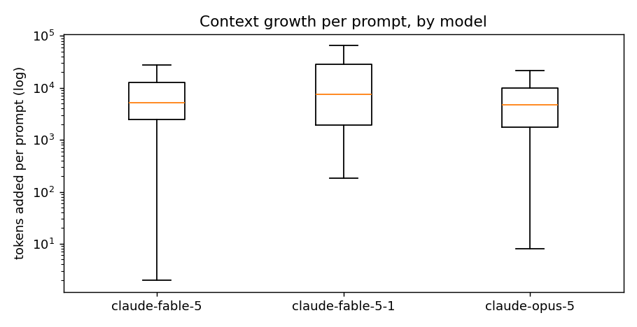
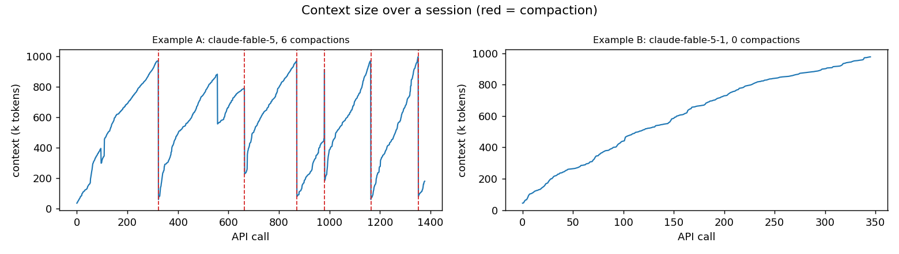
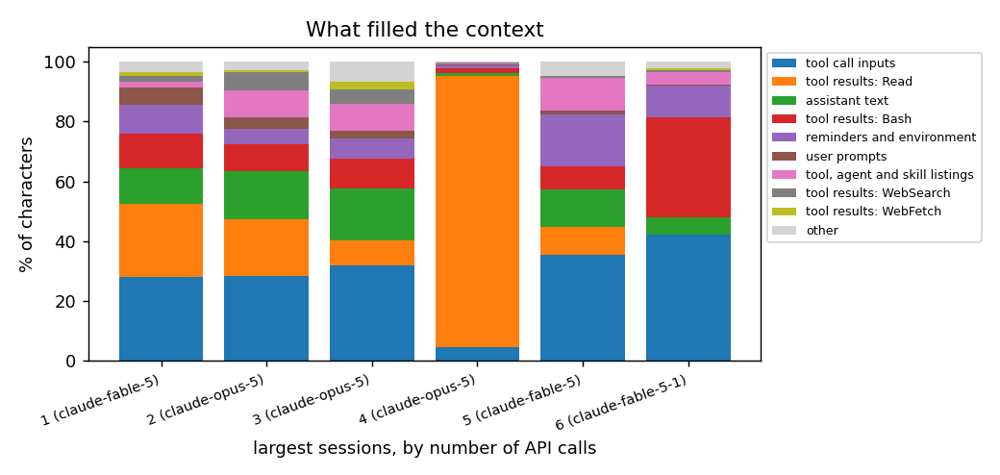

# First look: how context is consumed and what compaction costs

Date: 2026-09-11. Toolkit 0.1.0. Produced with `ctxeng report --publish`: aggregates and ranges
only, no per-session rows. Definitions are in [metrics.md](../metrics.md); the caveats at the end
matter.

## The corpus

- A few hundred sessions from one Claude Code installation over about three months, June to
  September 2026, spanning Claude Code 2.1.x releases and four models: Opus 4.8, Opus 5, Fable 5,
  Fable 5.1.
- Most sessions are short and automated. Fifteen have at least five API calls and carry the
  analysis; ten of those filled at least half of a one-million-token window.
- Nearly every call ran at one of the two highest effort levels.
- Close to half of the project folders had already been emptied by the default 30-day retention
  before the analysis began. Whatever those sessions would have shown is gone.

## 1. How many prompts fill the window

Over sessions that filled at least half of the window.

| model | sessions | prompts per fill, min | median | max |
|---|---|---|---|---|
| Fable 5 | 4 | 61 | 89 | 102 |
| Fable 5.1 | 3 | 29 | 33 | 68 |
| Opus 5 | 3 | 55 | 89 | 142 |

The Fable 5.1 sessions filled the window in 29 to 68 prompts, median 33. The earlier models took
55 to 142, median 89 for both. This is the clearest single number behind the feeling that the
window "fills quickly now". It is also the most confounded: different projects, different weeks,
different kinds of work.

## 2. Context growth per prompt

Median and 90th percentile of tokens added to the context while one prompt was handled, over
prompts that reached the model. Models backed by fewer than three sessions are omitted.

| model | sessions | prompts | added, median | added, p90 | API calls, median | API calls, p90 | tool calls, median | tool result chars, median |
|---|---|---|---|---|---|---|---|---|
| Fable 5 | 10 | 714 | 5,205 | 26,334 | 3 | 8 | 2 | 775 |
| Fable 5.1 | 4 | 120 | 7,544 | 82,126 | 4 | 13 | 4.5 | 1,986 |
| Opus 5 | 6 | 302 | 4,671 | 22,476 | 3 | 13 | 2 | 991 |

Fable 5.1 adds about 45% more per prompt at the median than Fable 5 and three times more at the
90th percentile. It makes roughly twice the tool calls per prompt and pulls in two and a half
times the tool-result text. The distribution is also much wider: a typical prompt is only
somewhat more expensive, but the expensive ones are far more expensive.

By effort level:

| effort | sessions | prompts | added, median | added, p90 | API calls, median | API calls, p90 |
|---|---|---|---|---|---|---|
| high | 3 | 52 | 5,336 | 15,969 | 2.5 | 8 |
| xhigh | 14 | 479 | 4,670 | 22,879 | 2 | 11 |
| max | 10 | 567 | 6,496 | 35,013 | 3 | 10 |

Maximum effort adds about 40% more per prompt than xhigh at the median and about 55% more at the
90th percentile. The `high` sample is too small to say much, and lower levels were not used.

## 3. What compaction keeps

Eleven compaction events, grouped by what triggered them.

| trigger | events | tokens before | tokens after | retained | duration | summary size |
|---|---|---|---|---|---|---|
| manual | 6 | 964k to 978k | 11k to 25k | 1.1% to 2.6% | 2.4 to 4.0 min | 17k to 30k chars |
| automatic | 5 | 805k to 1,017k | 19k to 111k | 1.9% to 13.8% | 2.4 to 5.3 min | 20k to 34k chars |

- Every compaction fired between 0.80M and 1.02M tokens. Nobody compacts early.
- Manual compactions kept 1.1% to 2.6% of the context. Automatic ones kept 1.9% to 13.8%; the two
  that kept more than 8% preserved a longer tail of recent messages.
- The summary itself is 17k to 34k characters, roughly 4k to 8k tokens. Everything else the new
  window holds is preserved recent messages.
- Each compaction took two and a half to five minutes of wall-clock time.

Example A is the session with the most compactions; Example B is the largest session that never
compacted. The shape is the same everywhere: near-linear growth to the limit, then a cliff.

## 4. The first turn after a compaction

Turns that start from a compaction summary rather than a typed prompt, compared with ordinary
turns.

| turn starts from | turns | added, median | added, p90 | API calls, median | API calls, p90 | tool calls, median | tool result chars, median |
|---|---|---|---|---|---|---|---|
| a compaction summary | 5 | 12,347 | 32,541 | 4 | 17 | 4 | 2,537 |
| a user prompt | 1,147 | 5,335 | 28,811 | 3 | 10 | 2 | 877 |

The re-orientation turn costs about 2.3 times a normal turn at the median, with twice the tool
calls and three times the tool-result text: the model re-reading what the summary left out. Five
data points, but all in the same direction.

## 5. What fills the context

Share of characters that entered the context, by source, over the six largest sessions. The
median describes a typical session; the pooled figure weights sessions by volume and is
dominated by one very large session.

| source | typical session | pooled | range across sessions |
|---|---|---|---|
| tool call inputs (writes, edits, commands) | 30% | 17% | 5% to 42% |
| tool results: Read | 14% | 57% | 0% to 90% |
| assistant text | 12% | 7% | 1% to 17% |
| tool results: Bash | 9% | 6% | 2% to 33% |
| reminders and environment | 8% | 5% | 1% to 17% |
| tool, agent and skill listings | 7% | 3% | 0% to 11% |
| user prompts | 2% | 2% | 0% to 6% |
| web search and fetch results | 2% | 2% | 0% to 9% |
| compaction summaries | 1% | 1% | 0% to 2% |

The six sessions are numbered by size and labelled by model. The spread between them is the
point: no two sessions are filled the same way.

- The model's own tool inputs are the largest source in a typical long session: file content
  going out through Write and Edit, and commands going out through Bash.
- Tool results come next, and which tool dominates varies wildly. Session 4 was 90% Read
  results, which is why the pooled column looks so different from the typical one.
- What the person typed is 2% of a typical session. Compaction summaries are 1%.
- Injected context is not free. Listings and reminders together are about 15% of a typical
  session. The listing of available skills and tools is re-injected during a session, several
  thousand tokens each time and dozens of times in the longest sessions. Notices carrying the new
  contents of files that changed on disk also recur dozens of times at a few thousand characters
  each.

Baseline context on the first call, by model (median over every session that made a call):
Fable 5.1 about 24k tokens, Opus 4.8 about 27k, Opus 5 about 37k, Fable 5 about 37k. Two to four
percent of the window. The 90th percentiles are much higher because resumed sessions start with
history already present. The fixed overhead is real but it is not what fills the window.

## 6. Context drops that are not compactions

Ten falls of at least 10% between consecutive calls with no compaction record. Eight of them
coincide with a mid-session model switch, in both directions, and the same context measured 16%
to 45% smaller on the call after the switch. Two consequences: raw token counts should not be
compared across models without correction, and a model switch is, incidentally, a way to buy back
a large slice of the window. The two same-model drops are unexplained; tool-result clearing and a
rewind are the candidates.

## What this supports

| hypothesis | verdict from this corpus |
|---|---|
| H1 newer model consumes more per prompt | Supported. Higher median, much higher tail, more tool calls, a third of the prompts per fill. Confounded. |
| H2 higher effort consumes more per prompt | Supported at max versus xhigh. Lower levels untested. |
| H3 the quality drop comes from how much compaction discards | Consistent. 86% to 99% discarded; the next turn costs 2.3 times normal. Direct quality proxies not yet measured. |
| H4 fixed overhead is a large share of the window | Not supported. 2% to 4%. |
| H5 a few sources dominate growth | Supported. Tool inputs and tool results are half to nine tenths. |

## Caveats

- Ten long sessions carry the analysis, three of them on the newest model. Splits by model and
  effort are observational and confounded by project and task.
- Token counting differs by model, as section 6 shows, so cross-model token comparisons carry an
  uncertainty of the same order as some of the differences reported.
- Composition is estimated from characters and measures what entered the context, not what
  occupied it at any moment.
- Nearly every session ran at the two highest effort levels, so the effort comparison is narrow.
- Splits by Claude Code version are too thin to publish; versions are confounded with model and
  time in this corpus anyway.

## Open questions

1. What does the model actually do in the turns after a compaction? Files re-read, commands
   re-run, corrections from the user. This is the direct measure of the quality drop.
2. Are re-injected listings and edited-file notices sent to the model each time they are
   recorded, and what do they cost in tokens rather than characters?
3. What caused the same-model context drops?
4. Would compacting earlier, from a less crowded window, produce a summary that retains more of
   what matters?

Next steps are in the [roadmap](../roadmap.md).
